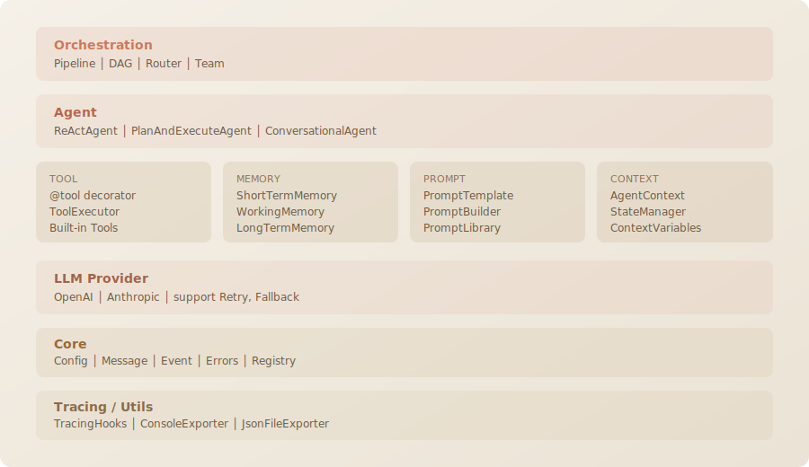

<p align="center">
  
</p>

<p align="center">
  <b>Lightweight, Easy-to-use, and Extensible Agent Framework</b>
</p>

<p align="center">
  
  <a href="README_ZH.md"></a>
</p>

Build AI agents your way — from a simple tool-calling assistant to multi-agent
parallel workflows. Agent Harness provides production-ready building blocks for
tool use, context management, and orchestration, with every component designed
to be understood, modified, and extended.

> **No magic, no lock-in. Clone it, hack it, make it yours.**

---

## Highlights

### Get Started in Minutes

⚡ **Simple Agent API** — Define tools with `@tool`, create an agent, call `run()`. A working agent in under 10 lines of code.

🔧 **Zero-Boilerplate Tools** — The `@tool` decorator auto-generates Tool JSON Schema from type hints and docstrings. Sync and async functions both work out of the box.

🧩 **Hackable by Design** — Clean abstractions, no hidden magic. Every component — agents, tools, memory, LLM providers — can be subclassed, swapped, or rewritten to fit your needs.

### Scale to Complex Workflows

🤖 **Agent Patterns** — `ReActAgent` for tool-calling loops, `PlanAndExecuteAgent` for multi-step task decomposition with replanning, `ConversationalAgent` for direct LLM interaction.

🔀 **Orchestration Modes** — Chain agents in a `Pipeline`, run them in parallel with `DAGOrchestrator`, dispatch by intent with `AgentRouter`, or collaborate as an `AgentTeam` (supervisor / debate / round-robin).

🧱 **Structured Context** — Conversation buffer, working scratchpad, and long-term knowledge retrieval — agents build and maintain the context they need across steps.

### Production Ready

🔍 **Built-in Tracing** — Every LLM call, tool invocation, and reasoning step is traced automatically with span hierarchy. Console and JSON exporters included.

🌐 **Provider Agnostic** — OpenAI and Anthropic supported out of the box, with built-in retry, rate limiting, and fallback chains. Swap providers without changing agent code.

⚙️ **Flexible Configuration** — YAML config for all components, environment variable overrides, per-agent customization.

---

## Quick Start

### 1. Setup

```bash
git clone https://github.com/yourname/Agent-Harness.git
cd Agent-Harness

# Create environment (choose one)
conda env create -f environment.yml    # conda
# or: python -m venv .venv && source .venv/bin/activate
# or: uv venv && source .venv/bin/activate

pip install -e ".[dev]"
```

### 2. Configure

Create a `config.yaml` (see [config_example.yaml](config_example.yaml) for all options):

```yaml
llm:
  provider: openai
  model: gpt-5.4
  api_key: sk-...
  base_url: https://api.openai.com/v1
  reasoning_effort: high
  # ...
```

> All values can be overridden via environment variables with `HARNESS_` prefix (e.g. `HARNESS_LLM_MODEL`).

### 3. Run an Example

```bash
python examples/react_agent.py           # ReAct agent with tool calling
python examples/react_agent.py --stream  # streaming mode
```

### 4. Build Your Own Agent

```python
import asyncio
from agent_harness import ReActAgent, tool, HarnessConfig

@tool
def calculate(expression: str) -> str:
    """Evaluate a math expression.

    Args:
        expression: A valid Python math expression like '2 + 3 * 4'.
    """
    return str(eval(expression))

async def main():
    config = HarnessConfig.load("config.yaml")
    agent = ReActAgent(
        name="assistant",
        tools=[calculate],
        config=config,
    )
    result = await agent.run("What is (42 * 37 + 15) / 3?")
    print(result.output)
    print(f"Steps: {result.step_count}, Tokens: {result.usage.total_tokens}")

asyncio.run(main())
```

---

## Architecture

<p align="center">
  
</p>

### Built-in Observability

Every LLM call, tool invocation, and reasoning step is traced automatically:

```
▶ [agent] agent.assistant (start)
  input: What's the weather in Paris and Tokyo? Also, what is the population of France divided by 4?
  ✓ [internal] step.1 (9073.0ms)
    agent: assistant
    • llm_call {agent=assistant, message_count=2}
    • tool_call {agent=assistant, tool=get_weather, args={'city': 'Paris'}}
    • tool_call {agent=assistant, tool=get_weather, args={'city': 'Tokyo'}}
    • tool_call {agent=assistant, tool=get_population, args={'country': 'France'}}
    • tool_result {content='Paris: 17°C, rainy'}
    • tool_result {content='Tokyo: 20°C, partly cloudy'}
    • tool_result {content='68 million'}
  ✓ [internal] step.2 (1464.4ms)
    agent: assistant
    • llm_call {agent=assistant, message_count=6}
    • tool_call {agent=assistant, tool=calculate, args={'expression': '68_000_000/4'}}
    • tool_result {content='17000000.0'}
  ✓ [internal] step.3 (2119.9ms)
    agent: assistant
    • llm_call {agent=assistant, message_count=8}
✓ [agent] agent.assistant (12659.1ms)
```

---

## Examples

The `examples/` directory contains ready-to-run scripts covering core capabilities:

- **[react_agent.py](examples/react_agent.py)** — ReAct reasoning loop with custom tools, supporting both generate and stream modes
- **[plan_and_execute.py](examples/plan_and_execute.py)** — Automatic task decomposition into steps, step-by-step execution with tools, and dynamic replanning
- **[multi_agent_pipeline.py](examples/multi_agent_pipeline.py)** — Three orchestration patterns in one file: sequential Pipeline, parallel DAG, and intent-based Router
- **[agent_team.py](examples/agent_team.py)** — Multi-agent collaboration with supervisor, debate, and round-robin modes
- **[deep_research.py](examples/deep_research.py)** — Full-stack orchestration: planning → parallel research (DAG) → cross-review (Team) → final synthesis
- **[skill_demo.py](examples/skill_demo.py)** — Demonstrates how to use `skills` for specific tasks, with a writing refinement example

---

## Contributing

Agent Harness is built to be extended. If you've built a useful tool, added a new agent pattern,
or improved an existing module, we'd love to see it contributed.

All contributions are welcome — just keep the existing style and have fun building.

This project is released under the [MIT License](LICENSE).
